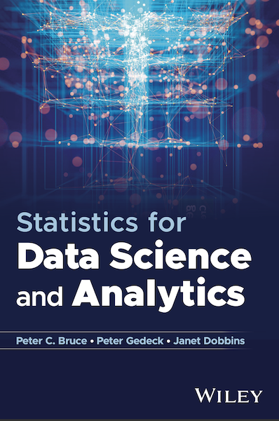

<table>
<tr>
<td></td>
<td>
    <h3>Statistics for Data Science and Analytics</h3>
    
by Peter C. Bruce, <a href="https://www.amazon.com/Peter-Gedeck/e/B082BJZJKX/">Peter Gedeck</a>, Janet Dobbins

    <ul>
    <li>Publisher: Wiley; 1st edition (20242019)</li>
    <li>ISBN-13: TBD</li>
    </ul>
</td>
</tr>

# Code repository for "Statistics for Data Science and Analytics"

## Running the code in this repository
The Python code expects the dataset files in the same directory. You will need to copy them from the `datasets` directory to 